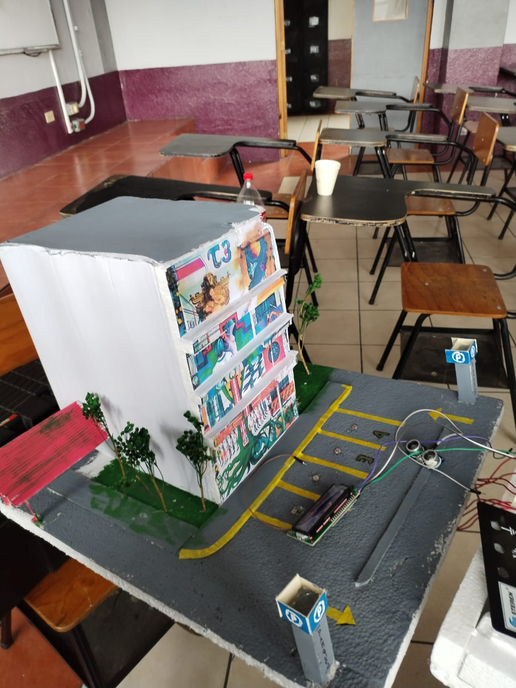
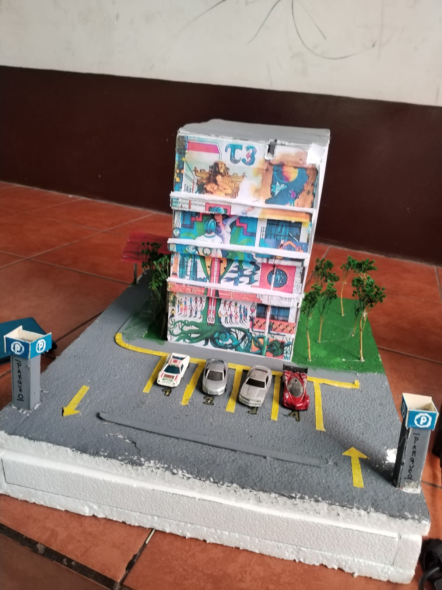
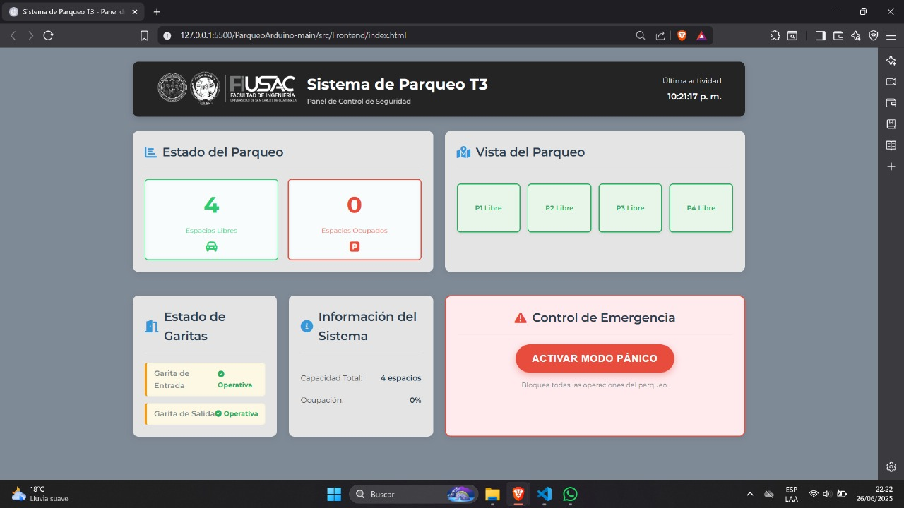
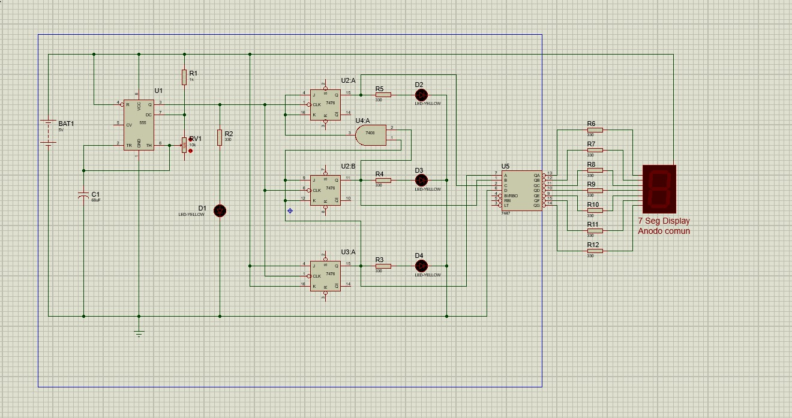

  

# Universidad de San Carlos de Guatemala  
## Facultad de Ingeniería  
### Escuela de Ciencias y Sistemas  
### Laboratorio de Organización Computacional  
### Ing. Fernando Paz
### Auxiliar: Jorge De León
---

# 🧠 Proyecto Final: Proyecto 1 - Parqueo Automatizado T3

**Integrantes:**  

- Erick Daniel Ajche Hernández – *201701043*  
- David Andrés Jiménez Paniagua – *202004777*  
- Oscar Vladimir Nij Cruz – *202100076*  
- Carlos Alejandro Rosales Medina – *201901657* 

  📅 <strong>Fecha de entrega:</strong> 27 de junio de 2025

---

## 📘 Índice

1. [Introducción](#introducción)  
2. [Objetivos del Proyecto](#objetivos-del-proyecto)  
3. [Descripción del Problema](#descripción-del-problema)  
4. [Requerimientos](#requerimientos)  
5. [Propuesta de Maqueta](#propuesta-de-maqueta)  
6. [Frontend del Sistema de Parqueo](#frontend-del-sistema-de-parqueo)  
7. [Funcionalidad de los Modos desde el Frontend](#funcionalidad-de-los-modos-desde-el-frontend) 
8. [Diagramas de los Diseños Desarrollados](#diagramas-de-los-diseños-desarrollados)  
9. [Equipo Utilizado](#equipo-utilizado)  
10. [Presupuesto](#presupuesto)  
11. [Conclusiones](#conclusiones)  
12. [Anexos](#anexos)

---

## 📌 Introducción

El objetivo del proyecto es crear un modelo funcional de un sistema de estacionamiento automatizado para el edificio T3 de la Facultad de Ingeniería, empleando lógica combinacional y secuencial. Este sistema representa una solución contemporánea para la gestión de vehículos, facilitando la entrada, conteo y salida de los mismos, además de incluir medidas de seguridad y distintos modos de operación. Esta actividad posibilita la aplicación de los conocimientos aprendidos a lo largo del curso, abarcando el diseño con compuertas lógicas, el uso de flip-flops, la temporización, sensores, servomotores y microcontroladores como el Arduino.

---

## 🎯 Objetivos del Proyecto

### 🎯 Objetivo General

Aplicar los conocimientos teóricos aprendidos en clase magistral y laboratorio para la construcción de circuitos combinacionales y secuenciales.

### ✅ Objetivos Específicos

- construccion de un sistema que una la lógica combinacional a la lógica secuencial. 
- Poner en práctica los conocimientos de Lógica Combinacional y Mapas de Karnaugh.
- Aprender el funcionamiento de diferentes elementos electromecánicos.
- Empezar a conocer sobre el uso de microcontroladores.
- Construir un diseño óptimo, logrando utilizar la menor cantidad de dispositivos.
- Resolución de problemas mediante Electrónica Digital.
- Aprender diferentes usos para la lógica secuencial.

---
## 🧠 Descripción del problema

El edificio T3 de la Facultad de Ingeniería ha solicitado a su equipo del curso de Organización Computacional el desarrollo de una maqueta funcional de un sistema automatizado de parqueo, inspirado en soluciones modernas de control vehicular. El objetivo es simular una solución eficiente y automatizada para el manejo de espacios de parqueo dentro del campus.

 - En la entrada del parqueo tenga una garita automática en el cual se pueda extraer un ticket, posteriormente se levante la barra para que pueda pasar el vehículo.
 - Deberá llevar el conteo de vehículos que hay en el parqueo, así como de los espacios disponibles.
 - Se trabaja con un solo nivel de 4 espacios, simulando el parqueo del T3.
 - El vehículo tendrá 20 segundos para poder pasar por la garita posteriormente la garita bajará la barra para que no pase dicho vehículo

---
## 📌 Requerimientos 

### ✩ Garita:
Se trabajará por medio de un sensor de proximidad el cual al momento que detecte un objeto le enviará la señal al Arduino para poder activar la barra e ingresar el vehículo.

### ✩ Palanca de la Garita:

Se usará un servomotor el cual recibirá un pulso del Arduino para poder moverlo 90° hacia arriba, una vez pasado 20 segundos, deberá de bajar la palanca a su estado inicial el cual es de 0°.

### ✩ Contador de Parqueos vacíos y llenos:
Se colocará un contador de parqueos vacíos y un de parqueos llenos los cuales se estará manejando por medio de contadores ascendentes y descendentes, para lo cual se deberá de implementar por medio de sensores el funcionamiento de la ocupación de parqueos.

### ✩ Salida del Parqueo:
Se trabajará por medio de un sensor de proximidad el cual al momento que detecte un objeto le enviará la señal al Arduino para poder activar la barra y la salida del vehículo. Se usará un servomotor el cual recibirá un pulso del Arduino para poder moverlo 90° hacia arriba, una vez pasado 3 0 segundos, deberá de bajar la palanca a su estado inicial el cual es de 0°.

### ✩ Resguardo del Parqueo:
Para resguardar los vehículos se implementará un sistema de seguridad en el cual, al momento de presionar un botón de pánico, se cerrará el parqueo y se procederá a activar la alarma de robo para que llegue la seguridad, y la cual será desactivada solo por medio de la garita de salida y por el agente de seguridad a través de la computadora principal.

---

## Propuesta de maqueta 

<table>
<tr>
<td></td>
<td></td>
</tr>
<tr>
<td align="center"><b>Figura 1:</b> Propuesta inicial del diseño del circuito</td>
<td align="center"><b>Figura 2:</b> Implementación final del sistema</td>
</tr>
</table>

Las figuras anteriores muestran la evolución del diseño desde la propuesta inicial hasta la implementación final del sistema de parqueo automatizado.

---

## 🔹 Frontend del Sistema de Parqueo

El frontend representa la interfaz gráfica de usuario que permite monitorear y controlar el parqueo automatizado. Está diseñado para simular una central de monitoreo desde la computadora principal. Se compone de varios paneles que cumplen funciones clave para la operación y seguridad del sistema.

<table>
<tr>
<td></td>
<tr>
<td align="center"><b>Figura 1:</b> Propuesta inicial del diseño del frontend  </td>

</tr>
</table>

Las figuras anteriores muestran la evolución del diseño desde la propuesta inicial hasta la implementación final del sistema de parqueo automatizado .

### 🖥 Componentes del Frontend:

#### 1.  🔘 Panel de Estado

- Muestra gráficamente los espacios disponibles y ocupados en tiempo real.

- Puede representarse con íconos de un auto  (🚗) que cambian de color o estado según estén libres u ocupados.

#### 2.  📈 Panel de Estadísticas

- Visualiza el promedio de vehículos por hora.

- Presenta una gráfica en tiempo real que refleja la cantidad de parqueos ocupados conforme pasa el tiempo.

- Se tiene que ver el promedio de carros por hora, gráfica en tiempo real de la cantidad de parqueos ocupados. (1punto promedio, 2 puntos la gráfica)

### 3. 🚨 Botón de Pánico

 Al presionarlo:

- Se bloquea el ingreso y salida de vehículos.

- Se activa la alarma sonora.

### 4. 🔐 Sistema de Desactivación

- Permite desactivar la alarma y volver al modo normal.

- Requiere el ingreso de una contraseña desde el frontend.

- La contraseña debe ser las iniciales de los 4 integrantes, como se usó en la Práctica 1 del laboratorio.

---

## ⚙️ Funcionalidad de los Modos desde el Frontend

El frontend permite cambiar entre modos especiales mediante autenticación:

| Modo           | Entrada | Salida | Alarma | Cambia con contraseña |
|----------------|---------|--------|--------|------------------------|
| **Normal**     | ✅       | ✅      | ❌     | N/A                    |
| **Pánico**     | ❌       | ❌      | ✅     | ✅                    |
| **Mantenimiento** | ❌    | ✅      | ❌     | ✅                    |
| **Nocturno**   | ❌       | ❌      | ❌     | ✅                    |
| **Evacuación** | ✅       | ✅      | ✅     | ✅                    |

> 📝 _No se puede cambiar directamente entre modos especiales. Siempre debe pasarse por el modo normal._

---

##  Diagramas de los diseños desarrollados

### Diagrama de contador ascendente

<table>
<tr>
<td></td>
</tr>
<tr>
<td align="center"><b>Figura 3:</b> Diagrama de contador ascendente</td>
</tr>
</table>

### Diagrama de contador descendente

<table>
<tr>
<td></td>
</tr>
<tr>
<td align="center"><b>Figura 4:</b> Diagrama de contador descendente</td>
</tr>
</table>

---

##  Equipo utilizado

**Hardware:**

- Arduino (UNO)
- Sensores de proximidad
- Fotoresistencias 
- Servomotores
- Flip-flops
- buzzer activo 5V
- Panta led 1602 
- Compuertas lógicas (7408, 7432, etc.)
- Protoboards, cables, fuentes, etc.

**Software:**

- Proteus
- Lenguaje de programación: (por ejemplo, C++, Python, JavaScript)
- Editor: (VS Code, Arduino IDE, etc.)

---

##  Presupuesto

### Gastos

para este proyecto  dicho presupuesto fue contemplado en cada fase del trabajo siendo un resultado total de ciento dos  quetzales con cincuenta centavos  (Q 102.50) dicha cantidad se logró mantener al margen de presupuesto logrando la optimización y reducción de compra  debido aque ya se contaban con componentes adquiridos de tiempo atras  si en la situación requería de reemplazos de componentes defectuosos o adquisición de los mismo se dispone de un presupuesto asequible para cada uno de los integrantes del grupo dicho así se logro evadir dicho problema  

| Componente              | Cantidad | Precio Unitario | Total   |
|-------------------------|----------|------------------|---------|
| Fotoresistencias  GL7539 LDR DE 7mm | 6   | Q 6.50          |  Q 39.00 |
|Panta led 1602            | 1        | Q 51.00         | Q 51.00  |
| buzzer activo 5V         | 1        | Q 4.50          | Q 4.50 |
|  cables                  | 4        | Q 2.00  * m    | Q 8.00 |
| **Total**               |          |                  | **Q 102.50** |

 

###  Aporte de cada integrante

- Erick Ache(201701043):
 Elaboracion del contador acendente y decendente  

- Carlos Rosales (201901657):
 adquisicion de componentes , diabgrama de proteus  contador acendente .

- David Jimenez (202004777):
Elaboracion de codigo arduino para pantalla y servomotores 

- Oscar Nij (202100076):
Elaboración de maqueta diabgrama de proteus  contador decendente y documentación. 

---

##  Conclusiones

Dicho Proyecto 1 facilitó la integración y aplicación práctica de los conocimientos sobre electrónica digital. A través del diseño e implementación de un sistema automatizado de estacionamiento, se enfrentaron retos reales relacionados con el control de acceso de vehículos, la gestión de espacios y la seguridad. La fusión de componentes electromecánicos, sensores, flip-flops y microcontroladores, junto a una interfaz visual, ofreció una solución integral, funcional y escalable. Este proyecto no solo reforzó las competencias técnicas del equipo, sino que también promovió el trabajo en equipo, la resolución de problemas y el uso responsable de las herramientas tecnológicas. La experiencia adquirida será una base sólida para futuros avances en el ámbito de la automatización y sistemas embebidos.

---
## Anexos 

- Enlace a [Repositorio GitHub - Proyecto_ORGA_G2](https://github.com/Ale-Rosales/Proyecto_ORGA_G2.git)

